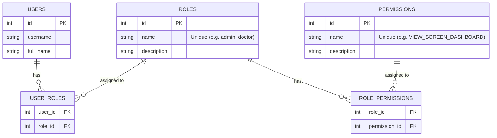

# Authorization Database Design (RBAC)

This document describes the current database design for the authorization system, which follows the **Role-Based Access Control (RBAC)** model.

## Overview

The system allows assigning **Roles** to **Users**, and **Permissions** to **Roles**. This provides a flexible way to manage access control.

- A **User** can have multiple **Roles**.
- A **Role** can have multiple **Permissions**.
- Access is granted based on whether a user has a role that possesses the required permission.

## Database Schema

The design consists of 5 main tables:

1.  **`users`**: Stores user accounts.
2.  **`roles`**: Stores role definitions (e.g., `admin`, `doctor`, `nurse`).
3.  **`permissions`**: Stores granular permissions (e.g., `VIEW_SCREEN_DASHBOARD`, `CREATE_USER`).
4.  **`user_roles`**: A many-to-many junction table linking `users` and `roles`.
5.  **`role_permissions`**: A many-to-many junction table linking `roles` and `permissions`.

### Entity Relationship Diagram (ERD)

## Detailed Table Definitions

### 1. `roles`
Defines the high-level roles in the system.
- `id`: Primary Key.
- `name`: Unique identifier (e.g., `admin`, `doctor`, `nurse`).
- `description`: Human-readable description.

### 2. `permissions`
Defines specific capabilities or access rights.
- `id`: Primary Key.
- `name`: Unique identifier (e.g., `VIEW_SCREEN_DASHBOARD`, `EDIT_PATIENT_RECORD`).
- `description`: Description of what the permission allows.

### 3. `user_roles`
Connects users to roles.
- `user_id`: Foreign key to `users`.
- `role_id`: Foreign key to `roles`.
- **Constraint**: Primary Key is `(user_id, role_id)` to prevent duplicate role assignments for the same user.

### 4. `role_permissions`
Connects roles to permissions.
- `role_id`: Foreign key to `roles`.
- `permission_id`: Foreign key to `permissions`.
- **Constraint**: Primary Key is `(role_id, permission_id)`.

## Authorization Flow

1.  **Authentication**: The user logs in and receives an access token.
2.  **Request**: The user sends a request to a protected API endpoint.
3.  **Middleware Check**:
    - The system identifies the user from the token.
    - It retrieves the user's roles from `user_roles`.
    - It retrieves the permissions associated with those roles from `role_permissions`.
    - It checks if the user has the required permission (or role) to access the resource.

## Future Improvements

Currently, the API middleware might be checking for specific **Roles** (e.g., `requireAuthorization("admin")`).

To fully utilize this design, the middleware should be updated to check for **Permissions** instead:
- **Current**: `requireRole("admin")` -> Only allows users with the 'admin' role.
- **Recommended**: `requirePermission("VIEW_DASHBOARD")` -> Allows any user who has a role (Admin, Doctor, or Nurse) that possesses the 'VIEW_DASHBOARD' permission.

This allows for greater flexibility. For example, if you want to allow 'Nurses' to view the dashboard, you simply add the `VIEW_SCREEN_DASHBOARD` permission to the `nurse` role in the database, without changing any code.
